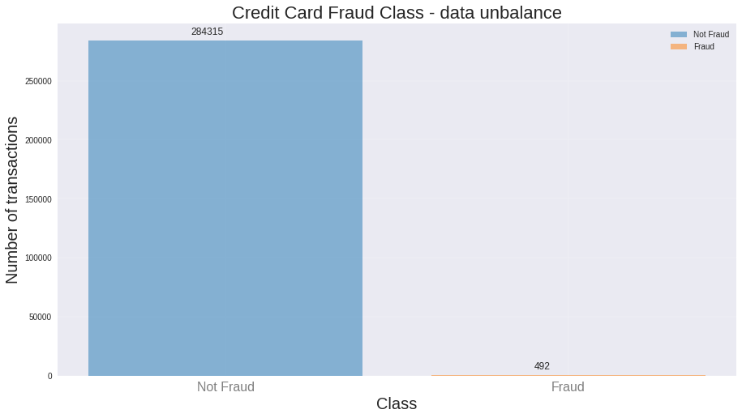
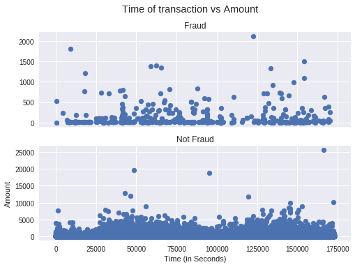

# ***Statistical learning***
### This repository intend to apply different statistical learning approaches on credit card fraud detection (Kaggle dataset):
##### 1. Naïve-Bayes.
##### 2. Random Forest (Number of estimator = 200).
##### 3. Non Linear Support Vector machine (Polynomial Kernel Degree = 3).
##### 4. K-Nearest Neighbors (K = 7).
##### 5. Gradient Boosting (Number of estimator = 200).

## Dataset:
Credit Card Fraud Detection:

https://www.kaggle.com/mlg-ulb/creditcardfraud

The datasets contains transactions made by credit cards in September 2013 by european cardholders. This dataset presents transactions that occurred in two days, where we have 492 frauds out of 284,807 transactions. The dataset is highly unbalanced.

#### Classes frequencies to show the unbalanced dataset:

This dataset contain 285k x 31 columns 
### Columns:
- Time: Number of seconds elapsed between this transaction and the first transaction in the dataset.
- V1 ... V28: A result of a PCA Dimensionality reduction to protect user identities and sensitive features.
- Amount: Transaction amount.
- Class: 1 for fraudulent transactions, 0 otherwise.

### Preporcessing:
- After plotting Time and Amount Features it is obvious that there is no need to use Time feature so we can droped it.

- Oversample train data to eliminate Unbalanced data effect and to improve Models Performance.
- StandardScale Amount feature to eliminate scale effect because all the other features are standard scaled (A result of PCA).

In all approches 2 cases were studied:
- Original data.
- Oversampled data (to improve models performance).

## Performance:
### Metrics:
1. ROC-AUC: Compute Area Under the Receiver Operating Characteristic Curve (ROC AUC) from prediction scores.
2. Recall: The recall is intuitively the ability of the classifier to find all the positive samples. it computes the ratio  True Positive/(True Positive+ False Negative) 

	
### Results

<table>
<tr><th>Original Data </th><th>Oversampled Data</th></tr>
<tr><td>

| Approches     |    ROC-AUC    | Recall|
| ------------- |:-------------:| -----:|
| K-NN          |     89.25%    |78.52% |
| Naîve Bayes   |     90.84%    |83.89% |
| Random Forest |     90.59%    |81.20% |
| Grad-Boosting |     63.06%    |26.17% |
| Kernel-SVM    |     87.57%    |75.16% |

</td><td>
  
| Approches     |    ROC-AUC    | Recall|
| ------------- |:-------------:| -----:|
| K-NN          |     94.51%    |89.26% |
| Naîve Bayes   |     92.43%    |87.24% |
| Random Forest |     93.61%    |87.24%|
| Grad-Boosting |     95.27%    |91.27% |
| Kernel-SVM    |     90.01%    |80.53% |

</td></tr> </table>

## NB:
From the above results it is obvous that:
- ROC-AUC and Recall scores in the case of original data are lower than the case of oversampled data in all approaches.
- Naîve bayes and Random forest have high ROC-AUC and Recall scores comparing them to other approaches.
- Gradient Boosting is the approach with the lower scores in the case of original data.
- Ensemble approaches (Random forest and gradient boosting) outperformed other approaches in the case of oversampled data specially Gradient Boosting approach.
- K-nearest neighbors is a good approach in this case.
